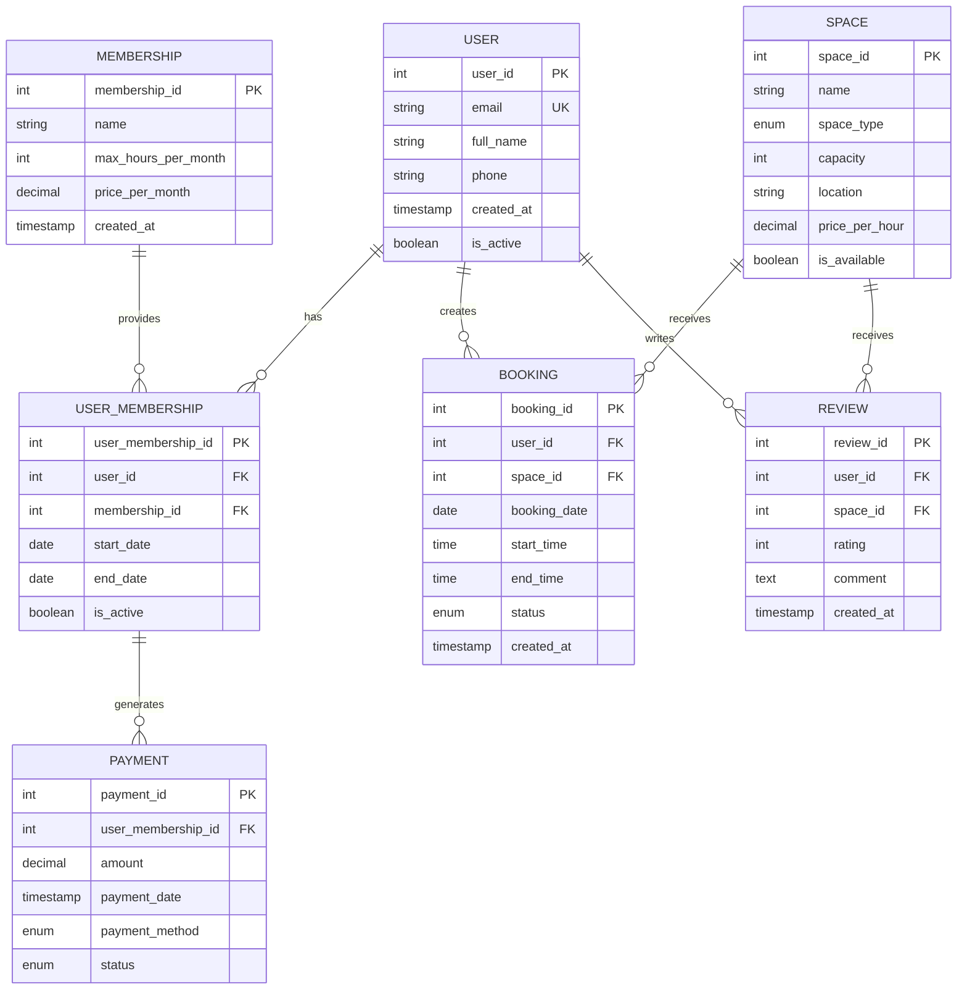

# ermodel.md — ER-діаграма системи бронювання коворкінгу

## Мermaid erDiagram



---

## Пояснення ER-діаграми

### Відношення (Relationships)

1. **USER → USER_MEMBERSHIP (1:M)**
   - Один користувач має одне або кілька членств
   - Кардинальність: `||--o{` (один до нуля або більше)

2. **MEMBERSHIP → USER_MEMBERSHIP (1:M)**
   - Один пакет членства належить багатьом користувачам
   - Кардинальність: `||--o{`

3. **USER_MEMBERSHIP → PAYMENT (1:M)**
   - Одне членство генерує багато платежів (помісячно)
   - Кардинальність: `||--o{`

4. **USER → BOOKING (1:M)**
   - Один користувач створює багато бронювань
   - Кардинальність: `||--o{`

5. **SPACE → BOOKING (1:M)**
   - Один простір отримує багато бронювань
   - Кардинальність: `||--o{`

6. **USER → REVIEW (1:M)**
   - Один користувач пише багато оцінок
   - Кардинальність: `||--o{`

7. **SPACE → REVIEW (1:M)**
   - Один простір отримує багато оцінок
   - Кардинальність: `||--o{`

---

## Кардинальності та примітки

| Зв'язок | Тип | Примітка |
|--------|-----|---------|
| USER → USER_MEMBERSHIP | 1:M | Користувач може змінювати членства протягом часу |
| MEMBERSHIP → USER_MEMBERSHIP | 1:M | Багато користувачів на один пакет |
| USER_MEMBERSHIP → PAYMENT | 1:M | Кожне членство має цикл платежів |
| USER → BOOKING | 1:M | Користувач бронює багато разів |
| SPACE → BOOKING | 1:M | Простір бронюється багато разів |
| USER → REVIEW | 1:M | Користувач може оцінити багато просторів |
| SPACE → REVIEW | 1:M | Простір отримує багато оцінок |

---

## Первинні та зовнішні ключі

### Первинні ключі (PK):
- `USER.user_id`
- `MEMBERSHIP.membership_id`
- `USER_MEMBERSHIP.user_membership_id`
- `SPACE.space_id`
- `BOOKING.booking_id`
- `PAYMENT.payment_id`
- `REVIEW.review_id`

### Унікальні ключі (UK):
- `USER.email` — унікальність email

### Зовнішні ключі (FK):
- `USER_MEMBERSHIP.user_id` → `USER.user_id`
- `USER_MEMBERSHIP.membership_id` → `MEMBERSHIP.membership_id`
- `BOOKING.user_id` → `USER.user_id`
- `BOOKING.space_id` → `SPACE.space_id`
- `PAYMENT.user_membership_id` → `USER_MEMBERSHIP.user_membership_id`
- `REVIEW.user_id` → `USER.user_id`
- `REVIEW.space_id` → `SPACE.space_id`

---

## Синтаксис Mermaid erDiagram

### Позначення кардинальності:
- `||` — точно один (one and only one)
- `o|` — нуль або один (zero or one)
- `||--` — один до одного
- `||--o{` — один до нуля або більше
- `}o--` — нуль або більше до нуля або більше

### Приклад:
```
USER ||--o{ BOOKING : creates
```
Означає: **Один USER створює нуль або більше BOOKING'ів**

---

## Валідація проти spec.md

✅ Усі сутності з `spec.md` представлені у діаграмі  
✅ Усі атрибути синхронізовані між `spec.md` та `erDiagram`  
✅ Кардинальності відповідають бізнес-правилам  
✅ Первинні та зовнішні ключі правильно позначені  
✅ Модель нормалізована до 3NF  

---

## Примітки щодо синтаксису

- **PK** — Primary Key (первинний ключ)
- **FK** — Foreign Key (зовнішний ключ)
- **UK** — Unique Key (унікальний ключ)
- **enum** — Перерахування значень (e.g., status в Booking: 'pending', 'confirmed', 'cancelled', 'completed')
- **decimal** — Число з плаваючою комою для грошових сум
- **timestamp** — Дата та час
- **date** — Тільки дата
- **time** — Тільки час
